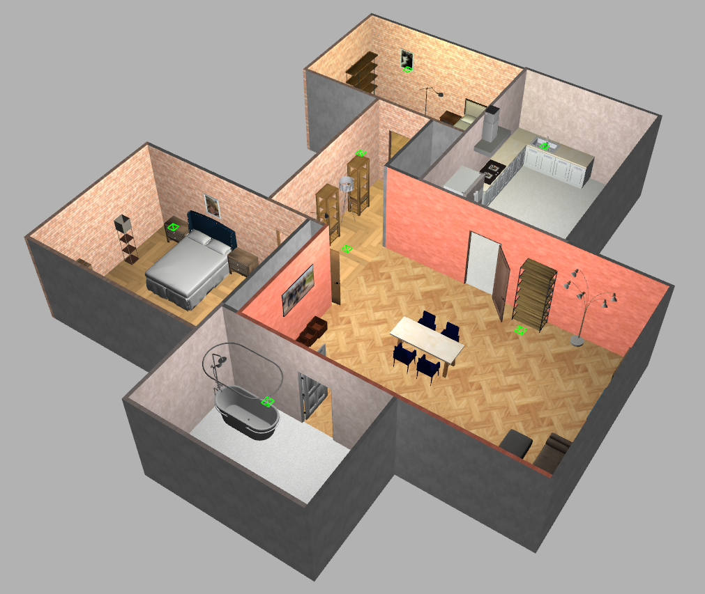

# Plasys house

This package contains the world of the Plasys house.

## Launch the world

To launch the world, you can use the following command:

```bash
ros2 launch plasys_house_world view_house.launch.py
```

